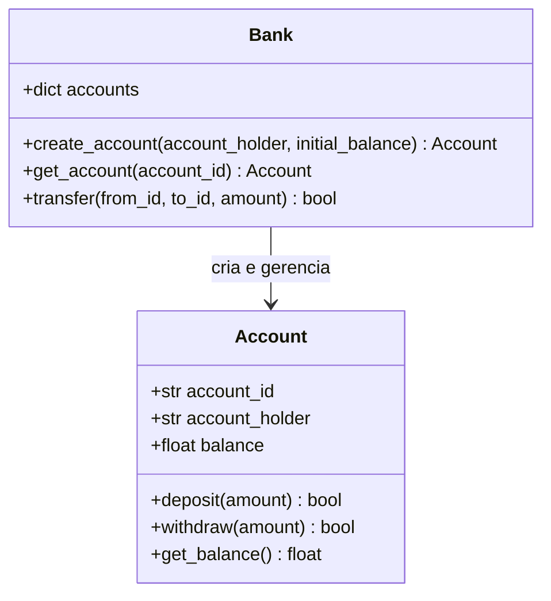
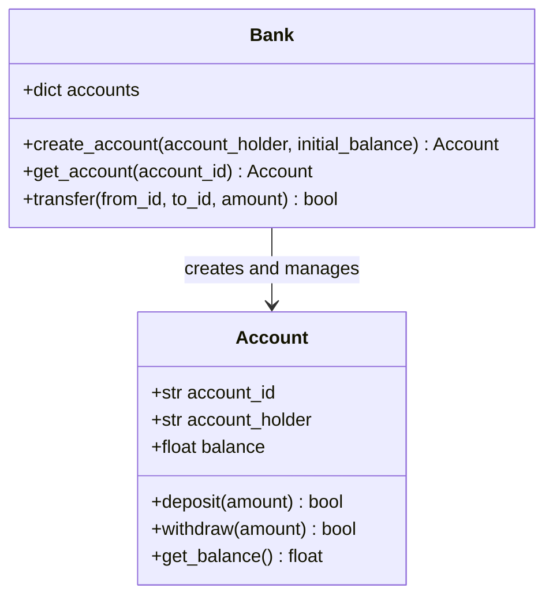

# Banking-System-Architecture

<div align="center">


</div>


[Portugues](#portugues) | [English](#english)

---

## Portugues

### Descricao

Sistema bancario simples em Python demonstrando arquitetura orientada a objetos com classes Account e Bank, operacoes de deposito/saque/transferencia e testes unitarios.

Este projeto contem 2 classes e aproximadamente 88 linhas de codigo-fonte Python. Utiliza apenas a biblioteca padrao do Python (stdlib), sem dependencias externas.

### O que este projeto faz

- Criacao de contas bancarias com saldo inicial
- Operacoes de deposito e saque com validacao
- Transferencias entre contas
- Rastreamento de saldo
- Representacao textual de contas

### O que este projeto NAO tem

- Persistencia ou banco de dados (armazenamento em memoria apenas)
- API web
- Autenticacao
- Suporte a Docker
- CI/CD
- Gerenciamento de configuracao
- Microsservicos

### Arquitetura



### Estrutura do Projeto

```
Banking-System-Architecture/
├── src/
│   ├── __init__.py
│   ├── main.py               # Ponto de entrada (demo CLI)
│   ├── accounts/
│   │   ├── __init__.py
│   │   └── account.py        # Classe Account
│   └── transactions/
│       ├── __init__.py
│       └── bank.py            # Classe Bank
├── tests/
│   └── test_banking_system.py # 9 testes unitarios
├── database/
│   └── schema.sql             # Esquema SQL de referencia (nao utilizado pelo codigo)
├── requirements.txt
├── LICENSE
└── README.md
```

### Como Executar

```bash
git clone https://github.com/galafis/Banking-System-Architecture.git
cd Banking-System-Architecture
python -m src.main
```

### Testes

9 testes unitarios cobrindo deposito, saque, saldo, representacao textual, criacao de conta, consulta de conta, transferencia com sucesso, transferencia com saldo insuficiente e transferencia com conta invalida.

```bash
python -m pytest tests/ -v
```

### Tecnologias

- Python (apenas biblioteca padrao)
- pytest (dependencia de desenvolvimento)

### Observacoes

O arquivo `database/schema.sql` existe como referencia para um futuro design de banco de dados, mas nao e utilizado pelo codigo atual. Todo armazenamento e feito em memoria usando um dicionario Python.

### Licenca

Este projeto esta licenciado sob a Licenca MIT - veja o arquivo [LICENSE](LICENSE) para detalhes.

### Autor

**Gabriel Demetrios Lafis**
- GitHub: [@galafis](https://github.com/galafis)
- LinkedIn: [Gabriel Demetrios Lafis](https://linkedin.com/in/gabriel-demetrios-lafis)

---

## English

### Description

Simple banking system in Python demonstrating object-oriented architecture with Account and Bank classes, deposit/withdraw/transfer operations, and unit tests.

This project contains 2 classes and approximately 88 lines of Python source code. It uses only the Python standard library (stdlib), with no external dependencies.

### What this project does

- Bank account creation with initial balance
- Deposit and withdrawal operations with validation
- Transfers between accounts
- Balance tracking
- String representation of accounts

### What this project does NOT have

- Persistence or database (in-memory storage only)
- Web API
- Authentication
- Docker support
- CI/CD
- Configuration management
- Microservices

### Architecture



### Project Structure

```
Banking-System-Architecture/
├── src/
│   ├── __init__.py
│   ├── main.py               # Entry point (CLI demo)
│   ├── accounts/
│   │   ├── __init__.py
│   │   └── account.py        # Account class
│   └── transactions/
│       ├── __init__.py
│       └── bank.py            # Bank class
├── tests/
│   └── test_banking_system.py # 9 unit tests
├── database/
│   └── schema.sql             # Reference SQL schema (not used by code)
├── requirements.txt
├── LICENSE
└── README.md
```

### How to Run

```bash
git clone https://github.com/galafis/Banking-System-Architecture.git
cd Banking-System-Architecture
python -m src.main
```

### Tests

9 unit tests covering deposit, withdrawal, balance, string representation, account creation, account lookup, successful transfer, insufficient funds transfer, and invalid account transfer.

```bash
python -m pytest tests/ -v
```

### Technologies

- Python (standard library only)
- pytest (dev dependency)

### Notes

The `database/schema.sql` file exists as a reference for a future database design but is not used by the current code. All storage is done in-memory using a Python dictionary.

### License

This project is licensed under the MIT License - see the [LICENSE](LICENSE) file for details.

### Author

**Gabriel Demetrios Lafis**
- GitHub: [@galafis](https://github.com/galafis)
- LinkedIn: [Gabriel Demetrios Lafis](https://linkedin.com/in/gabriel-demetrios-lafis)
