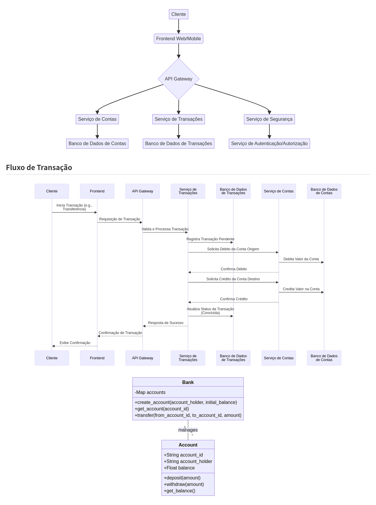

# Arquitetura de Sistema Bancário


## Visão Geral

Este repositório apresenta uma arquitetura de sistema bancário modular e escalável, projetada para demonstrar as melhores práticas em desenvolvimento de software para o setor financeiro. O objetivo é fornecer uma base robusta para a construção de aplicações bancárias modernas, com foco em segurança, desempenho, manutenibilidade e conformidade regulatória. A arquitetura proposta visa facilitar a integração de novos serviços e a adaptação a futuras demandas do mercado.

## Funcionalidades Chave

O sistema bancário hipotético suporta as seguintes funcionalidades essenciais:

*   **Gestão de Contas:** Abertura, fechamento, consulta de saldo, extrato detalhado e gerenciamento de diferentes tipos de contas (corrente, poupança, investimento).
*   **Transações Financeiras:** Depósitos, saques, transferências interbancárias (TED/DOC) e intrabancárias, pagamentos de contas e agendamentos.
*   **Segurança Robusta:** Implementação de autenticação multifator (MFA), autorização baseada em papéis (RBAC), criptografia de dados em trânsito e em repouso, e monitoramento contínuo de atividades suspeitas.
*   **APIs RESTful:** Interface bem definida para integração com sistemas externos, parceiros e aplicativos móveis, utilizando padrões de segurança como OAuth2.
*   **Relatórios e Análises:** Geração de relatórios financeiros, dashboards de acompanhamento e ferramentas de análise para suporte à decisão.

## Estrutura do Projeto

O projeto é organizado nas seguintes pastas, refletindo uma abordagem de microserviços ou módulos bem definidos:

*   `src/`: Contém o código-fonte principal dos serviços backend, organizados por domínio (e.g., `src/accounts`, `src/transactions`).
*   `tests/`: Inclui testes unitários, de integração e de ponta a ponta para garantir a qualidade e a robustez do código.
*   `docs/`: Armazena toda a documentação do projeto, incluindo especificações técnicas, guias de API, diagramas de arquitetura e manuais de usuário.
*   `config/`: Arquivos de configuração para diferentes ambientes (desenvolvimento, homologação, produção).
*   `frontend/`: Contém a interface de usuário, desenvolvida com tecnologias web modernas (HTML, CSS, JavaScript, frameworks como React ou Angular).
*   `database/`: Scripts de migração de banco de dados, esquemas e dados de exemplo.

## Tecnologias Utilizadas

Esta arquitetura emprega uma combinação de tecnologias modernas para garantir escalabilidade, resiliência e facilidade de desenvolvimento:

*   **Backend:** Python (Flask/Django) ou Java (Spring Boot) para os microserviços.
*   **Banco de Dados:** PostgreSQL para dados transacionais e MongoDB para dados não estruturados ou logs.
*   **Mensageria:** Apache Kafka ou RabbitMQ para comunicação assíncrona entre serviços.
*   **Cache:** Redis para caching de dados e sessões.
*   **Frontend:** React.js ou Vue.js para uma experiência de usuário dinâmica.
*   **Containerização:** Docker para empacotamento e isolamento de serviços.
*   **Orquestração:** Kubernetes para gerenciamento e escalabilidade de contêineres.
*   **Cloud:** Implantação em plataformas como AWS, Google Cloud ou Azure.

## Como Executar

### Pré-requisitos

Certifique-se de ter as seguintes ferramentas instaladas em seu ambiente:

*   Python 3.x
*   pip (gerenciador de pacotes Python)
*   Docker e Docker Compose (opcional, para execução em contêineres)
*   Node.js e npm/yarn (para o frontend)

### Instalação

1.  Clone o repositório:
    ```bash
    git clone https://github.com/galafis/Banking-System-Architecture.git
    cd Banking-System-Architecture
    ```
2.  Instale as dependências do backend (se houver um `requirements.txt`):
    ```bash
    pip install -r config/requirements.txt
    ```
3.  Instale as dependências do frontend (se houver um `package.json`):
    ```bash
    cd frontend
    npm install # ou yarn install
    cd ..
    ```

### Execução

Para iniciar o sistema (exemplo simples de um serviço backend):

```bash
python src/main.py
```

Para iniciar o frontend:

```bash
cd frontend
npm start # ou yarn start
cd ..
```

Para executar com Docker Compose (se configurado):

```bash
docker-compose up --build
```

## Diagramas da Arquitetura


*Diagrama ilustrativo da arquitetura de microserviços e seus componentes principais.*

## Fluxo de Transação


*Diagrama ilustrativo do fluxo de uma transação bancária no sistema.*

## Diagrama de Classes


*Diagrama de classes do sistema bancário, mostrando as relações entre as entidades Account e Bank.*

## Roadmap Futuro

*   Implementação de um módulo de empréstimos e financiamentos.
*   Adição de funcionalidades de investimento e portfólio.
*   Melhorias na interface do usuário e experiência do cliente.
*   Expansão para serviços de Open Banking e integração com APIs de terceiros.
*   Otimização de desempenho e escalabilidade para lidar com alto volume de transações.

## Contribuição

Consulte o arquivo `CONTRIBUTING.md` para obter diretrizes detalhadas sobre como contribuir para este projeto. Encorajamos a comunidade a propor melhorias, reportar bugs e adicionar novas funcionalidades.

## Licença

Este projeto está licenciado sob a licença MIT. Veja o arquivo `LICENSE` para mais detalhes.

## Autor

**Gabriel Demetrios Lafis**

Este projeto é uma demonstração de arquitetura de software e não deve ser utilizado em produção sem as devidas adaptações e validações de segurança e conformidade.

