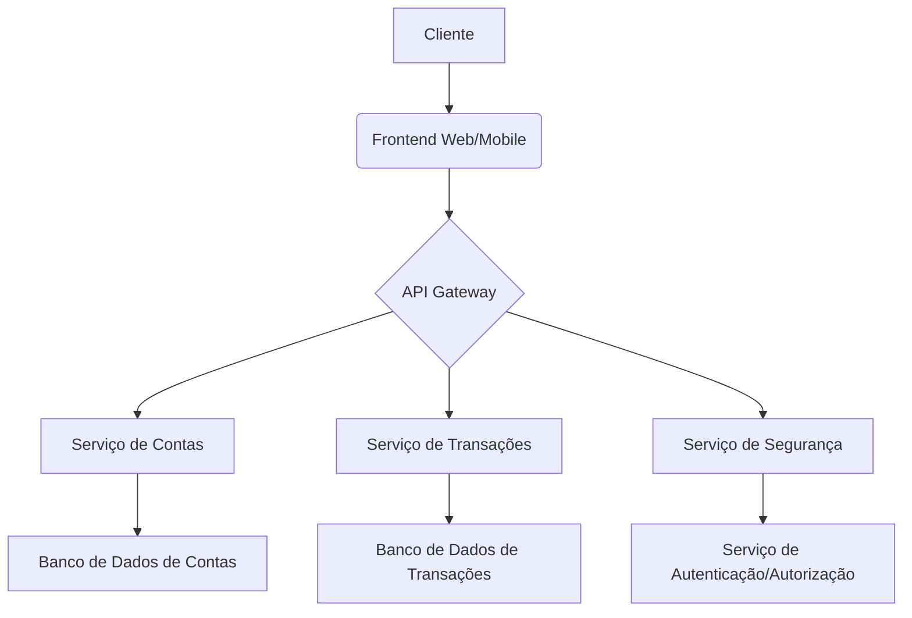

```mermaid
graph TD
    A[Cliente] --> B(Frontend Web/Mobile)
    B --> C{API Gateway}
    C --> D[Serviço de Contas]
    C --> E[Serviço de Transações]
    C --> F[Serviço de Segurança]
    D --> G[Banco de Dados de Contas]
    E --> H[Banco de Dados de Transações]
    F --> I[Serviço de Autenticação/Autorização]
```
