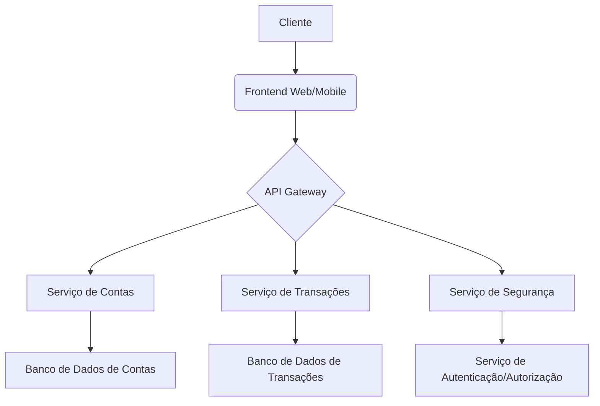
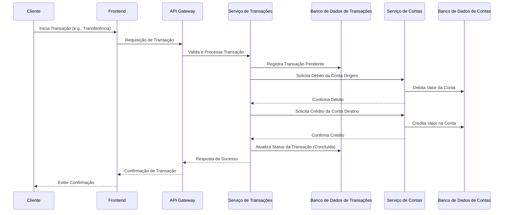

```mermaid
graph TD
    A[Cliente] --> B(Frontend Web/Mobile)
    B --> C{API Gateway}
    C --> D[Serviço de Contas]
    C --> E[Serviço de Transações]
    C --> F[Serviço de Segurança]
    D --> G[Banco de Dados de Contas]
    E --> H[Banco de Dados de Transações]
    F --> I[Serviço de Autenticação/Autorização]
```

## Fluxo de Transação

```mermaid
sequenceDiagram
    participant Cliente
    participant Frontend
    participant API_Gateway as API Gateway
    participant Servico_Transacoes as Serviço de Transações
    participant Banco_Transacoes as Banco de Dados de Transações
    participant Servico_Contas as Serviço de Contas
    participant Banco_Contas as Banco de Dados de Contas

    Cliente->>Frontend: Inicia Transação (e.g., Transferência)
    Frontend->>API_Gateway: Requisição de Transação
    API_Gateway->>Servico_Transacoes: Valida e Processa Transação
    Servico_Transacoes->>Banco_Transacoes: Registra Transação Pendente
    Servico_Transacoes->>Servico_Contas: Solicita Débito da Conta Origem
    Servico_Contas->>Banco_Contas: Debita Valor da Conta
    Servico_Contas-->>Servico_Transacoes: Confirma Débito
    Servico_Transacoes->>Servico_Contas: Solicita Crédito da Conta Destino
    Servico_Contas->>Banco_Contas: Credita Valor na Conta
    Servico_Contas-->>Servico_Transacoes: Confirma Crédito
    Servico_Transacoes->>Banco_Transacoes: Atualiza Status da Transação (Concluída)
    Servico_Transacoes-->>API_Gateway: Resposta de Sucesso
    API_Gateway-->>Frontend: Confirmação de Transação
    Frontend-->>Cliente: Exibe Confirmação
```

